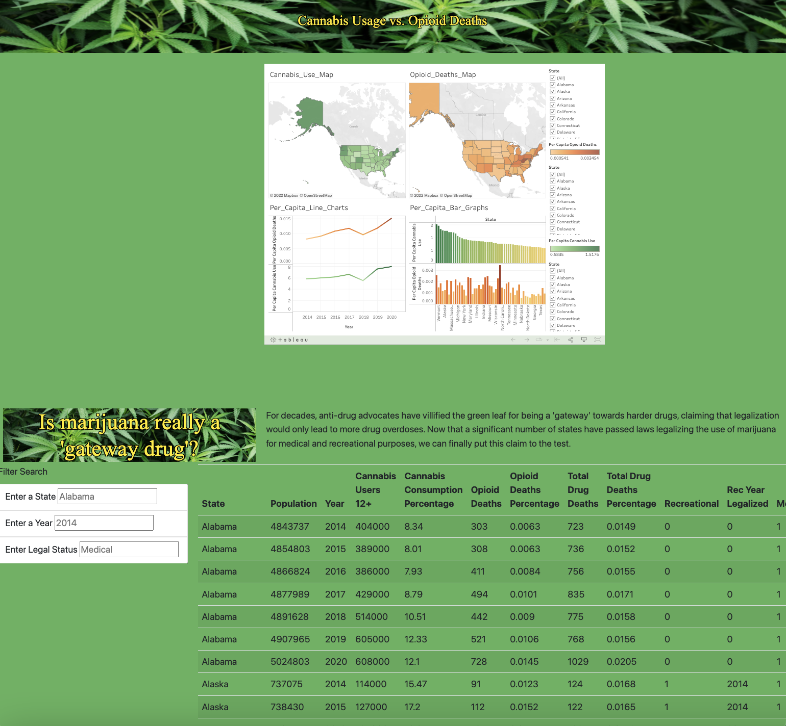

# UC Berkeley Extension Data Analytics Bootcamp Capstone Project, Group 13: "Analyses and Predictions: The Impact of Cannabis Legalization on the U.S. Opioid Crisis"

 
<b>(Team Logo)</b> 

<b>Finalized Site:</b> https://github.com/pladams777/Group_Project/deployments/activity_log?environment=github-pages

<b>Link to Presentation:</b> https://docs.google.com/presentation/d/18jxE-i2TfmQhpv64p8P7D3sQgM1D2Rxsgw4-KZ4hEFA/edit#slide=id.g159b14ad12e_3_784

## Introduction
As of this writing, cannabis remains federally illegal as a "Schedule 1" controlled substance, a categorization reserved for drugs that have no medical benefit and a high potential for abuse (along with, for instance, heroin and lysergic acid diethylamide (LSD)).

Proponents of decriminalizing and descheduling cannabis argue that it has been extenstively researched and scientifically validated as a plant that offers myriad physical health benefits, and with far less potential for lethal overconsumption than alcohol, for example, or even over-the-counter medications like acetaminophen (and they point to the 30,000+ cannabis-related studies published on the National Center for Biotechnology's PubMed.gov site in response to claims that it has not yet been researched or studied well enough to justify recreational legalization on a national level).

The War on Drugs that began in the US in the early 1970s has painted cannabis as a "gateway drug" that utlimately leads to the use of hard substances like cocaine or heroin.  Advocates of legalization argue to the contrary, touting the potential that cannabis has as an "exit drug," which many have turned to as an alternative to geniunely addictive and harmful substances, including opioids, to reduce withdrawal symptoms and to minimize pain.

## Why We Chose this Topic:
The opioid epidemic has had devastating consequences in the US, and cannabis, many theorize, is one potential contributor to its reversal.  While some studies (https://www.ncbi.nlm.nih.gov/pmc/articles/PMC7246665/) have looked at the correlation between cannabis consumption and opioid misuse in a handful of states following legalization at the state level, our group project aims to compare the same data for all 50 states, to see whether the data collectively, objectively can support the above theory that cannabis legalization is a viable mitigation strategy to address our opioid problem.

## Goals to Achieve and Questions to Answer
Our objective is an interactive dashboard that provides users with state-specific visualizations based on datasets from reliable sources (NIH, CDC, etc.) to see whether there are answers within the data to the following questions:

1. Is there consistently a negative correlation in all / most states between reported cannabis consumption and opioid misuse/deaths?

2. In states that have legalized medical and/or recreational marijuana, has there been a greater / sharper decline in reported opioid misuse/deaths in the year(s) following legalization, compared to states that have not yet lifted restrictions?

## Project Outline

This repository includes the following branches:

<b>Datasets</b> (contributions from Albert Zeng, John Landeen, Janasia Roemling)

<b>Dashboard and Visualizations</b> (Contributions from Paula Adams, Janasia Roemling, Jorge Jurado)

<b>Machine Learning</b> (contributions from John Landeen)

<b>Site</b> (contributions from Albert Zeng and John Landeen)

### Communication Protocols
Our team meets 4 times a week: 
  - twice a week in class via Zoom
  - twice a week outside of class via GoogleMeets

Outside of meetings, we communicate via Slack chat threads to keep one another up-to-date on our progress and new ideas.

We've agreed to keep the division of responsibility less formal and siloed than what is suggested in the Canvas Module 20 instructions.  Team members have not been assigned "shapes" that designate their roles; we've instead agreed to each contribute wherever our strengths allow us to, while requesting input and help from others as needed.  Each section of our project can therefore have more than one contributor, and each team member has contributed to more than one branch in this repository.
  
We will document our processes, challenges and conclusions in full detail in the following READMEs:
- Data Collection, Cleaning and Analysis: John Landeen, Albert Zeng, Janasia Roemling
- Dataframes Construction and ERD: Albert Zeng, Jorge Jurado, Paula Adams
- Machine Learning Models: John Landeen
- Dashboard and Visualizations: Jorge Jurado, Janasia Roemling, Paula Adams

## Data Collection and Sourcing

Our data sets will include the following:
- annual state population estimates (https://www.census.gov/programs-surveys/popest/technical-documentation/research/evaluation-estimates/2020-evaluation-estimates/2010s-state-total.html)
- An annual survey of self-reported cannabis consumption, once or more within the past year for ages 12 and up (https://www.samhsa.gov/data/nsduh/state-reports-NSDUH-2)
- Opioid prescribing rates per 100 people, ages 12 and older (https://www.cdc.gov/drugoverdose/rxrate-maps/index.html)
- Opioid overdose rates, ages 12 and older (https://www.kff.org/statedata/collection/opioid-epidemic/)

### Contributions
John:

Created AWS database and group project bucket for datasets

Initial building and modification for National Marijuana user survey dataset

Initial building and modification for Opioid Overdose dataset

Initial building and modification for Marijuana state legality dataset

Predictions calculated by XGBoost for datasets denoted with predictions

All machine learning model notebooks and outlines

Jan: Data sourcing for:

state population estimates
opioid prescribing rates by state
opioid overdose death rates by state
drug overdose death rates by state
cannabis consumption
Albert:

Cleaned and reorganized cannabis user data

Added Total US data to opioid deaths data

Cleaned and reorganized opioid deaths data

Merged cannabis and opioid data

Cleaned and merged US population data with cannabis and opioid data

Created per capita figures for cannabis use and opioid deaths

Paula

Data source for state legality
ERD image

### Opioid Statistics

#### 1. U.S. State Opioid Dispensing Rate Maps
The first sets of data we chose to consider for our analysis of US opioid statics are from the Centers for Disease Control and Prevention’s “U.S. State Opioid Dispensing Rate Maps,” for which the data is available from 2006 through 2020 on the CDC website (https://www.cdc.gov/drugoverdose/rxrate-maps/index.html).
As shown in the below example of their 2006 table, these data show the number of opioid prescriptions dispensed per 100 residents, per year, by state.
  

The source listed by the CDC for these data is “IQVIA Xponent 2006–2020,” which is based on a sample of approximately 50,400 retail pharmacies, which dispense nearly 92% of all retail prescriptions in the United States. For this database, a prescription is a new or refill prescription dispensed at a retail pharmacy in the sample and paid for by commercial insurance, Medicaid, Medicare, cash or its equivalent, and other third-party coverage. This database does not include mail order prescriptions.
#### 2. Drug Overdose Rates (ages 12 and older)
In addition to opioid prescribing rates, we’ve included the national numbers for drug fatalities (again, by state, per year), which we downloaded as CSV files from the CDC website for the years 2014 through 2020 (https://www.cdc.gov/drugoverdose/deaths/index.html).

Our intent was to gather data related only to opioid deaths.  We later realized that the data in these files depicts fatalities caused by all abused substances, not just opioids.  
Because the focus of our analysis is the correlation between cannabis consumption and opioid misuse specifically, we considered whether to incorporate the data tables for each of subcategorizations shown here:

However, we found this breakdown somewhat too specific for the purpose of our project; that is, for the sake of simplicity, our team is interested in deaths caused by all opioids, and less so in the type of opioid.  Including these data would entail downloading the tables for each opioid type and for each year, after which we would need to merge the tables and calculate the totals that we are after.
(Another disadvantage of the data is that it only dates back to 2016, which would leave us with two to three years of missing data.) 

(https://www.cdc.gov/drugoverdose/deaths/prescription/2019-2020.html)

(https://www.cdc.gov/drugoverdose/deaths/heroin/2019-2020.html)

(https://www.cdc.gov/drugoverdose/deaths/synthetic/2019-2020.html)

#### 3. Opioid Overdose Deaths by Age Group
To address our above issue, we continued in search of more user-friendly and efficiently compiled data, which we found through Kaiser Family Foundation (https://www.kff.org/statedata/collection/opioid-epidemic/), a nonprofit organization focusing on national health issues.

(https://www.kff.org/other/state-indicator/opioid-overdose-deaths-by-age-group/?currentTimeframe=0&sortModel=%7B%22colId%22:%22Location%22,%22sort%22:%22asc%22%7D)

The data, sourced from the National Vital Statistics System multiple cause-of-death mortality files, show the number of opioid overdose deaths by age group, by state, dating all the way back to 1999. 
This is important because by replacing the CDC Drug Overdose datasets (in point 2. above) with the KFF Opioid Overdose data, our group could expand our analysis by up to 15 years, which would easily resolve the issue we’ve encountered with a lack of data.  (The minimum requirement of this project is 1,000 rows of data and as of November 5, our group’s merged data table only totals approximately 350 rows.)

### Cannabis Statistics
#### 1. Cannabis Consumption by State
The National Survey on Drug Use and Health (NSDUH) (formerly the National Household Survey on Drug Abuse) tracks trends within the US in specific substance use, including cannabis, alcohol, tobacco, and various illicit and prescription drugs.

For our analysis, our team chose the NSDUH datasets with state-level small area estimates (SAEs) showing self-reported cannabis consumption, once or more within the past year (for respondents ages 12 and older), from 2014 to 2020.  These were available to download in CSV format from the U.S. Department of Health & Human Services’ Substance Abuse and Mental Health Services Administration (SAMHSA) website.

https://www.samhsa.gov/data/nsduh/state-reports-NSDUH-2020

#### 2. Cannabis Legality Status by State
The sources used to compile our dataset for cannabis legality status for each state included the following:
1.	National Conference of State Legislatures (https://www.ncsl.org/research/health/state-medical-marijuana-laws.aspx)
2.	Word Population Review (https://worldpopulationreview.com/state-rankings/marijuana-laws-by-state)

### Population Data
Lastly, we incorporated state population estimates, provided by the United States Census Bureau, in order to have a baseline for comparison to put the cannabis consumption and opioid statistics into perspective as per capita percentages.

https://www.census.gov/programs-surveys/popest/technical-documentation/research/evaluation-estimates/2020-evaluation-estimates/2010s-state-total.html

## Exploratory Data Analysis

### Data Cleansing

Once we had downloaded all of the necessary data relating to our project, the next step was to clean and process it so that it could be arranged in a way that would be easy to visualize. This process involved uploading the downloaded .csv files to Jupyter Notebook and then manipulating the data within each file. First, the file would be cleaned for any null values and unnecessary columns would be dropped. For example, data for each region of the United States was not necessary and was thus dropped from the dataset.

The next step was to make sure that all of the data was in the correct data format so that they could be merged with other datasets. Once that was done, the data from each csv could be merged with each other, creating bigger datasets.

In other occasions, new columns had to be created to capture more detailed information about the cannabis consumption and opioid death of each state with consideration to each state's population. To create these per capita figures, data on each state's population had to be uploaded, cleaned, and formatted. After that, new dataframes were created where a formula dividing the total numbers of opioid deaths and cannabis users by the state's total poulation was employed. Then, that dataset was merged with the rest of the data.

The next step in this process was to incorporate the legality of cannabis in each state and then merge that into the dataset. To do this, the legal status was split into three categories: recreationally legal (which by definition also means medically legal), only medically legal, and illegal. To sort each state into one of the three categories, either a 1 or a 0 was assigned to the recreational and medical status of each state with 1 meaning yes and 0 meaning no.

An additional colummn was added counting the number of years that medical and/or recreational cannabis has been legal in each state. This was created using a formula that took the year that medical or recreational cannabis, depending on which one was legal, and subtracted it from the current year 2022. 

The final step in this process was to merge the legality dataset with the other data. A merge on the state and year was made and the resulting mega dataset was formatted and then saved as a .csv file.

Our group found that there was a problem with the number of opioid deaths, which was that it was actually the number of total drug overdoses, not necessarily deaths from opioids. Once more accurate figures were obtained, the dataset was updated to include them. Additional columns with data on total drug deaths and the per capita figures were also included and merged with the file. 

### ERD 

## Dashboard and Visualizations
### Team Logo:

Our Team Logo was created on Adobe Illustrator. It represents our teams analytical research in the opioid overdose and cannabis consumption rates by state.

### Final Dashboard Layout
<b>Link to Dashboard:</b> https://public.tableau.com/app/profile/janasia.roemling/viz/Data_Analytics_Group_13_Cannabis_Opioid_Correlations_Final/Dashboard#1

### Legality Status Map

### Cannabis Consumption per Capita for each State
When measuring the Per Capita Cannabis Use by state, we color-coded our map to show the darker green states having the highest average annual per capita percentage of cannabis consumers.
Findings:
- Top 5 cannabis-consuming states per capita: Vermont, Colorado, Maine, Oregon, and Alaska.
- Bottom 5 cannabis-consuming states per capita: Utah, Mississippi, South Dakota, Iowa, and Texas.

### Per Capita Opioid Overdoses by State
When measuring the Per Capita Cannabis Use by state, we color-coded our map to show the darker red states having the highest average annual percentage of opioid overdose deaths.
Findings:
- Top 5 opioid-overdosing states: West Virginia, New Hampshire, Kentucky, Ohio, and New Mexico.
- Bottom 5 opioid-overdosing states: Kansas, California, North Dakota, Nebraska, and South Dakota.

### Correlation Cannabis Consumption per Capita vs Opioid Overdoses per Capita
When measuring the Correlation between Opioid Overdoses per capita vs Opioid Overdoses per capita by state, we color-coded our map to show red (lower correlation) and green (higher correlation) by state. We can now see the following results:
Findings:
- States with Strongest Correlation: Louisiana, Connecticut,  Florida, Missouri, and Illinois.
- States with Weakest Correlation: Utah, Oklahoma, Wyoming, Georgia, and Alaska.

Link to Tableau: https://public.tableau.com/app/profile/jorge.jurado/viz/CorrelationpercapitaCannabisConsumptionvspercapitaOpiodOverdoses/Story3?publish=yes

### Correlational Line Charts (filterable by State)

### Correlational Bar Graphs (filterable by State)

### No. of Years Legal vs. Per Capita Cannabis Usage & Overdose Deaths

https://public.tableau.com/app/profile/albert.zeng7834/viz/Cannabis_16679286599760/Sheet1?publish=yes

### Percentage Change in Annual Opioid Deaths Since 2014

## Site Design

### Purpose
The purpose of this segment of the project was serve as a storyboard for our project as a whole. In addition to stating the reasons behind the project, our goal was to display all of the results we had collected through the course of this investigation on a single webpage so that users can filter the data by state, year, and legal status and see the results for themselves. The site would also include a Tableau element that displayed graphical visualizations of our project. 

### Goals to Achieve and Questions to Answer

Since our main objective is an interactive webpage that provides users with state-specific visualizations, we needed to ensure that alter filter functions worked properly in displaying the correct data. It also meant that the Tableau dashboard had to be successfully embedded within the HTML code so that it would not just be an image, but a fully functioning interactive element.

### Tools and Technology

The creation of this comprehensive webpage involved the use of JavaScript and HTML. The index file contained the HTML code, which used elements from bootstrap for the title. The static folder included two JavaScript files: data.js and app.js. For the data file, we converted the percaps_w_legality csv file into a .json file so that it could be easily read by the index. The Tableau dashboard was added to the index file and successfully displayed at the center of the page above the data table. A separate style.css file was used with the site design to create the aesthetics of the site. Perhaps the most challenging part of the site was creating a working filter search function that would allow the use to filter the table by state, year, and legal status. While the state and legal status worked without issue, the year did not since it was an integer rather than a string. To solve this issue, we needed to revisit the app.js and specify that the input in that particular box would be an integer. 

## Machine_Learning
- Neural networking models and predictions ending with XGBoost modeling of original merged set
- XGBoost modeling of revised percap set
- Lasso vs SVM modeling and predictions
- Polyfit_linear_regression_variety modeling and predictions
- Preliminary Forecasting[Redacted]: Datetime data insufficient 

### preliminary data preprocessing ML input files:

* neural_networking_merged_set.ipynb
   * mega_merged.csv
      * Created with multiple Drug Overdose data tables from the CDC
      * Created with multiple Cannabis use data tables from the SAMHSA
* XGBoost_revised_percap_set.ipynb
   * revised_percap_data.csv
      * Created with multiple Drug Overdose data tables from the CDC
      * Created with multiple Cannabis use data tables from the SAMHSA
      * Created with Opioid data from KFF

### Description of preliminary feature engineering and preliminary feature selection, including decision-making process: 

* neural_networking_merged_set.ipynb
   * Label encoded State feature for ML use and sorted year in descending order to allow clear prediction of opioid deaths for the years 2019 and 2020
      * Dropped first 7 rows of dataset as US totals are offputting to machine learning
      * Label encoded the State column
      * Sorted data based on Year feature
      * Reset index
      * Dropped old index
      * Normalized keras layer is utilized for two of the four NN models
* XGBoost_revised_percap_set.ipynb
   * Label encoded State feature for ML use and prepared features to be in proper numerical format
      * Reset index
      * Label encoded the State column
      * Stripped percentage and returned to standard numerical form for all percentage columns
      * Stripped commas from all features containing commas
      * Converted the columns with commas stripped to int
* SVM_Lasso_merged_set.ipynb 
   * Dropped unnecessary rows and label encoded
      * Dropped first 7 rows of dataset as US totals are offputting to machine learning
      * Label encoded the State column
* Polyfit_linear_regression_variety_merged_set.ipynb
   * Dropped unnecessary rows, label encoded, and standard scaler is applied after train test split
      * Dropped first 7 rows of dataset as US totals are offputting to machine learning
      * Label encoded the State column
      * Standard Scaling is applied after Train test split passing the first two models

### Description of how data was split into training and testing sets:

* neural_networking_merged_set.ipynb
   * Neural Networking
      * Split into one shuffled test_dataset at 20% and one shuffled train_dataset at 80%
      * Copied each dataset
      * Removed dependant variable from each train and test set
      * Keras normilization layer adaptation of train set for full set normalizer implimentation
      * Keras normilization layer adaptation of train set feature 'Number of Cannabis Users' for cannabis_use_normalizer implimentation
   * XGBoost modeling
      * Dependant variable y is defined as the data feature 'Number of Opioid deaths' 
      * Independant variable(s) X is defined as all features that don't include 'Number of Opioid deaths' 
      * Train test split is instantiated with a test size of 29.3% and a train size of 70.7% and left unshuffled for a clear output of years 2019 and 2020
* XGBoost_revised_percap_set.ipynb   
   * Dependant variable y is defined as the data feature 'Number of Opioid deaths' 
   * Independant variable(s) X is defined as all features that don't include 'Number of Opioid deaths' 
   * Train test split is instantiated with a test size of 28.5% and a train size of 71.5% and left unshuffled for a clear output of years 2019 and 2020
* SVM_Lasso_merged_set.ipynb 
   * Dependant variable y is defined as the data feature 'Number of Opioid deaths' 
   * Independant variable(s) X is defined as all features that don't include 'Number of Opioid deaths' 
   * Train test split is instantiated with a test size of 25% and a train size of 75%
* Polyfit_linear_regression_variety_merged_set.ipynb
   * Dependant variable y is defined as the data feature 'Number of Opioid deaths' 
   * Independant variable(s) X is defined as all features that don't include 'Number of Opioid deaths' 
   * Train test split is instantiated with a test size of 20% and a train size of 80%

### Model choices, including limitations and benefits:

* neural_networking_merged_set.ipynb
   * Cannabis_use_model
      * Basic neural network linear model with an adapted keras normalization layer for 'Number of Cannabis Users' feature
         * Simplified estimation procedure
         * Easy to understand interpretation on a modular level
   * Linear_model
      * Basic neural network linear model with an adapted keras normalization layer for all independant features
         * Simplified estimation procedure
         * Easy to understand interpretation on a modular level
   * dnn_cannabis_model
      * The deep neural network model with 2 dense RELU layers in unit order 64,32 and output layer at 1
      * Model adapts normalizer for 'Number of Cannabis Users' feature
         * Allow models to become more efficient at learning complex features and performing more intensive computational tasks
         * Requires very large amount of data in order to perform better than other techniques
         * Expensive to train due to complex data models
   * dnn_model
      * The deep neural network model with 2 dense RELU layers in unit order 64,32 and output layer at 1
      * Model adapts normalizer for all independant feature
         * Allow models to become more efficient at learning complex features and performing more intensive computational tasks
         * Requires very large amount of data in order to perform better than other techniques
         * Expensive to train due to complex data models
   * XGBoost decision-tree-based ensemble
      * model with 500 n_estimators, max_depth of 50, eta of 0.01, and a tree_method of histogram   
         * Ideal for medium-small datasets
         * Does not need normalized features
         * Works well if the data is nonlinear, non-monotonic, or with segregated clusters
         * Can overfit with decision trees that go too deep with excess noise in the data
* XGBoost_revised_percap_set.ipynb
   * XGBoost decision-tree-based ensemble
      * model with 500 n_estimators, max_depth of 50, eta of 0.01, and a tree_method of histogram   
         * Ideal for medium-small datasets
         * Does not need normalized features
         * Works well if the data is nonlinear, non-monotonic, or with segregated clusters
         * Can overfit with decision trees that go too deep with excess noise in the data
* SVM_Lasso_merged_set.ipynb 
   * SVM
      * Effective for smaller datasets
      * Memmory efficient
      * It doesn't perform well with excess noise
   * Lasso
      * As any regularization method, it can avoid overfitting
      * It is fast in terms of inference and fitting
      * Does Shrinkage and variable selection simultaneously for better prediction and model interpretation
      * Lasso cannot do group selection
* Polyfit_linear_regression_variety_merged_set.ipynb
   * Linear Regression Model
      * Simplified estimation procedure
      * Easy to understand interpretation on a modular level
   * Polyfit Linear Regression Model
      * Polynomial provides the best approximation of the relationship between the dependent and independent variable
      * Simplified estimation procedure
      * Easy to understand interpretation on a modular level
   * Decision Tree Regression Model
      * Easy interpretation
      * Less data preparation
      * Non-Linearity
      * Easy to over fit
   * Decision Tree Regression with Target Regressor Model
      * Easy interpretation
      * Less data preparation
      * Non-Linearity
      * Easy to over fit
         * Target Regression is used to ensure linearity, to achieve normality, or to stabilize the variance
         * Relationship of the transformed variables to the original variables may be difficult or confusing
   * Random Forest Regression with Target regressor Model
      * It's nonlinear nature can give in a less conventional leg up over traditional linear algorithms
      * It requires much computational power as well as resources as it builds numerous trees to combine their outputs. It also requires much time for training as it combines a lot of decision trees to determine the class.
         * Target Regression is used to ensure linearity, to achieve normality, or to stabilize the variance
         * Relationship of the transformed variables to the original variables may be difficult or confusing
 

### Output Files:
* neural_networking_merged_set.ipynb
   * mega_merged_with_predictions.csv
* XGBoost_revised_percap_set.ipynb
   * revised_percap_data_with_predictions.csv

### Results:

In the modeling world, Neural Networks outperform most other models with unstructured data. But with structured or tabular data especially medium or small, the XGBoost decision tree based ensemble model is well known to take the cake. The best model performance for this project's small datasets goes to XGBoost for delivering the most ideal results for prediction differences, MAE scores, and RMSE scores. XGBoost metrics conclude after 500 epochs of training resulting in a Mean Absolute Error of about 17 and a Root Mean Square Error of about 40.

The Predictions (red) against actual (blue) show the best performer for small datasets, XGBoost, deliver the most accurate outcomes.

    

## Conclusion and Findings

What we discovered in our analysis of the data was that opioid death percentages have continued to rise in most states, independently of their cannabis policies.
The only states with a consistent overall decrease were Oklahoma, Utah and New Hampshire (all medically legal states).
As of 2020, the remaining states had increases since 2014 ranging from 37% (in Wyoming, where cannabis is illegal) to 554% (in the District of Columbia, where cannabis is fully legal).
- The coronavirus pandemic seemed to have played a significant role in the increase in both cannabis use and opioid deaths in 2020 which saw the reversal of almost all progress that some states had made towards reduced opioid fatalities between 2016 and 2018.
- In 2020 we saw cannabis consumption rising sharply potentially indicating a strong positive correlation with rise in opioid deaths.

Limitations:
This analysis was limited by factors such as the willingness of cannabis users to accurately self-report their use and the accuracy in reporting opioid deaths where there might have been comorbidities that also contributed. Also, the length of available data – it would be worth studying again once data from 2021 & 2022 are available.
