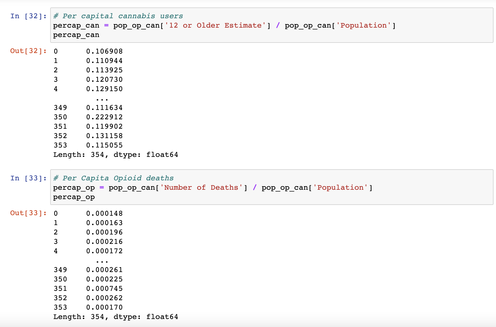

# Datasets README

John: 

- Created AWS database and group project bucket for datasets

- Initial building and modification for National Marijuana user survey dataset

- Initial building and modification for Opioid Overdose dataset

- Initial building and modification for Marijuana state legality dataset

- Predictions calculated by XGBoost for datasets denoted with predictions

- All machine learning model notebooks and outlines

Jan:
Data sourcing for:
- state population estimates
- opioid prescribing rates by state
- opioid overdose death rates by state
- drug overdose death rates by state
- cannabis consumption

Albert:

- Cleaned and reorganized cannabis user data

- Added Total US data to opioid deaths data

- Cleaned and reorganized opioid deaths data

- Merged cannabis and opioid data

- Cleaned and merged US population data with cannabis and opioid data

- Created per capita figures for cannabis use and opioid deaths

Paula
- Data source for state legality
- ERD image

# Data Exploration
## Opioid Statistics

### 1. U.S. State Opioid Dispensing Rate Maps
The first sets of data we chose to consider for our analysis of US opioid statics are from the Centers for Disease Control and Prevention’s “U.S. State Opioid Dispensing Rate Maps,” for which the data is available from 2006 through 2020 on the CDC website (https://www.cdc.gov/drugoverdose/rxrate-maps/index.html).
As shown in the below example of their 2006 table, these data show the number of opioid prescriptions dispensed per 100 residents, per year, by state.
  

The source listed by the CDC for these data is “IQVIA Xponent 2006–2020,” which is based on a sample of approximately 50,400 retail pharmacies, which dispense nearly 92% of all retail prescriptions in the United States. For this database, a prescription is a new or refill prescription dispensed at a retail pharmacy in the sample and paid for by commercial insurance, Medicaid, Medicare, cash or its equivalent, and other third-party coverage. This database does not include mail order prescriptions.
### 2. Drug Overdose Rates (ages 12 and older)
In addition to opioid prescribing rates, we’ve included the national numbers for drug fatalities (again, by state, per year), which we downloaded as CSV files from the CDC website for the years 2014 through 2020 (https://www.cdc.gov/drugoverdose/deaths/index.html).

Our intent was to gather data related only to opioid deaths.  We later realized that the data in these files depicts fatalities caused by all abused substances, not just opioids.  
Because the focus of our analysis is the correlation between cannabis consumption and opioid misuse specifically, we considered whether to incorporate the data tables for each of subcategorizations shown here:

However, we found this breakdown somewhat too specific for the purpose of our project; that is, for the sake of simplicity, our team is interested in deaths caused by all opioids, and less so in the type of opioid.  Including these data would entail downloading the tables for each opioid type and for each year, after which we would need to merge the tables and calculate the totals that we are after.
(Another disadvantage of the data is that it only dates back to 2016, which would leave us with two to three years of missing data.) 

(https://www.cdc.gov/drugoverdose/deaths/prescription/2019-2020.html)

(https://www.cdc.gov/drugoverdose/deaths/heroin/2019-2020.html)

(https://www.cdc.gov/drugoverdose/deaths/synthetic/2019-2020.html)

### 3. Opioid Overdose Deaths by Age Group
To address our above issue, we continued in search of more user-friendly and efficiently compiled data, which we found through Kaiser Family Foundation (https://www.kff.org/statedata/collection/opioid-epidemic/), a nonprofit organization focusing on national health issues.

(https://www.kff.org/other/state-indicator/opioid-overdose-deaths-by-age-group/?currentTimeframe=0&sortModel=%7B%22colId%22:%22Location%22,%22sort%22:%22asc%22%7D)

The data, sourced from the National Vital Statistics System multiple cause-of-death mortality files, show the number of opioid overdose deaths by age group, by state, dating all the way back to 1999. 
This is important because by replacing the CDC Drug Overdose datasets (in point 2. above) with the KFF Opioid Overdose data, our group could expand our analysis by up to 15 years, which would easily resolve the issue we’ve encountered with a lack of data.  (The minimum requirement of this project is 1,000 rows of data and as of November 5, our group’s merged data table only totals approximately 350 rows.)

## Cannabis Statistics
### Cannabis Consumption by State
The National Survey on Drug Use and Health (NSDUH) (formerly the National Household Survey on Drug Abuse) tracks trends within the US in specific substance use, including cannabis, alcohol, tobacco, and various illicit and prescription drugs.

For our analysis, our team chose the NSDUH datasets with state-level small area estimates (SAEs) showing self-reported cannabis consumption, once or more within the past year (for respondents ages 12 and older), from 2014 to 2020.  These were available to download in CSV format from the U.S. Department of Health & Human Services’ Substance Abuse and Mental Health Services Administration (SAMHSA) website.

https://www.samhsa.gov/data/nsduh/state-reports-NSDUH-2020

### Cannabis Legality Status by State
The sources used to compile our dataset for cannabis legality status for each state included the following:
1.	National Conference of State Legislatures (https://www.ncsl.org/research/health/state-medical-marijuana-laws.aspx)
2.	Word Population Review (https://worldpopulationreview.com/state-rankings/marijuana-laws-by-state)

## Population Data
Lastly, we incorporated state population estimates, provided by the United States Census Bureau, in order to have a baseline for comparison to put the cannabis consumption and opioid statistics into perspective as per capita percentages.

https://www.census.gov/programs-surveys/popest/technical-documentation/research/evaluation-estimates/2020-evaluation-estimates/2010s-state-total.html

# Exploratory Data Analysis

## Data Cleansing

Once we had downloaded all of the necessary data relating to our project, the next step was to clean and process it so that it could be arranged in a way that would be easy to visualize. This process involved uploading the downloaded .csv files to Jupyter Notebook and then manipulating the data within each file. First, the file would be cleaned for any null values and unnecessary columns would be dropped. For example, data for each region of the United States was not necessary and was thus dropped from the dataset.

The next step was to make sure that all of the data was in the correct data format so that they could be merged with other datasets. Once that was done, the data from each csv could be merged with each other, creating bigger datasets.

In other occasions, new columns had to be created to capture more detailed information about the cannabis consumption and opioid death of each state with consideration to each state's population. To create these per capita figures, data on each state's population had to be uploaded, cleaned, and formatted. After that, new dataframes were created where a formula dividing the total numbers of opioid deaths and cannabis users by the state's total poulation was employed. Then, that dataset was merged with the rest of the data.

The next step in this process was to incorporate the legality of cannabis in each state and then merge that into the dataset. To do this, the legal status was split into three categories: recreationally legal (which by definition also means medically legal), only medically legal, and illegal. To sort each state into one of the three categories, either a 1 or a 0 was assigned to the recreational and medical status of each state with 1 meaning yes and 0 meaning no.

An additional colummn was added counting the number of years that medical and/or recreational cannabis has been legal in each state. This was created using a formula that took the year that medical or recreational cannabis, depending on which one was legal, and subtracted it from the current year 2022. 

The final step in this process was to merge the legality dataset with the other data. A merge on the state and year was made and the resulting mega dataset was formatted and then saved as a .csv file.

Our group found that there was a problem with the number of opioid deaths, which was that it was actually the number of total drug overdoses, not necessarily deaths from opioids. Once more accurate figures were obtained, the dataset was updated to include them. Additional columns with data on total drug deaths and the per capita figures were also included and merged with the file. 

